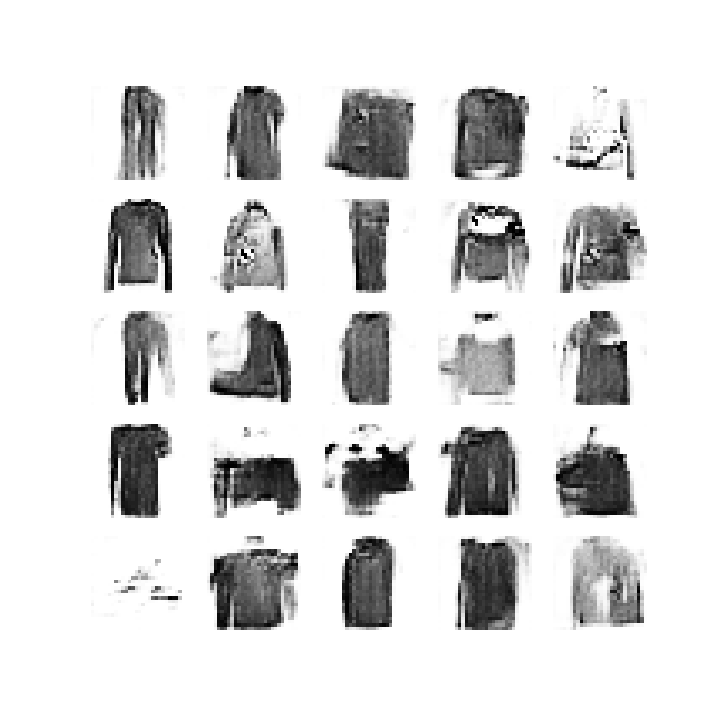

# Synthetic Images DCGAN

## Data Set Used

MNIST fashion dataset is used for this task.

## Network

Deep Convolutional Generative Adversarial Network (DCGAN) is used for the synthesis of these images

A demo gif of images can be found 
